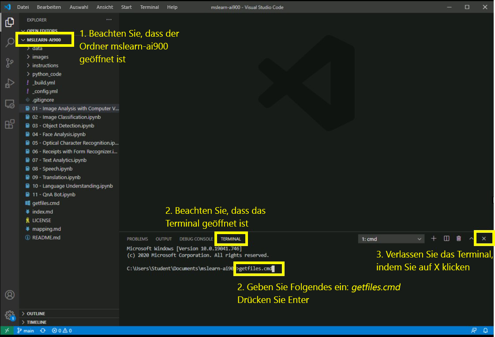

# AI-900-Labs
## Verwenden von Visual Studio Code

1.  Starten Sie Visual Studio Code (das Programmsymbol wird an die untere Taskleiste angeheftet). Nach dem Öffnen sollte das Projekt „MSLEARN-AI900“ im linken Bereich angezeigt werden.
2.  Wir pullen die neueste Version des Projekts. Geben Sie im geöffneten Terminal +++getfiles.cmd+++ ein, und drücken Sie die **Eingabetaste**. Dieser Befehl pullt die neueste Version des Projekts in Ihren Ordner. 
3.  Nachdem der Befehl ausgeführt wurde, können Sie den Terminalbereich schließen. Sie können jetzt mit dem Lab beginnen. 

